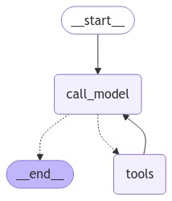

# Webex AI Assistant

This project implements an AI-powered assistant bot for Webex Teams, leveraging OpenAI's language models, LangChain, and LangGraph to provide intelligent responses and perform tasks. It uses SQLite to maintain conversation history, allowing for contextual interactions.

## Features

- Web search capabilities using Tavily Search
- Retrieval of Webex user information
- Mathematical operations (power calculation as example)
- Integration with Webex Teams
- Advanced AI reasoning using LangGraph
- Persistent conversation history for improved context awareness
- Conversation context maintenance using SQLite

## Technology Stack

This project utilizes several key technologies:

- **LangChain**: A framework for developing applications powered by language models.
- **LangGraph**: A library for building stateful, multi-actor applications with LLMs. It enables the creation of complex, graph-based workflows for AI agents.
- **OpenAI**: Provides the underlying language model for natural language processing and generation.
- **Webex Bot**: Facilitates integration with Webex Teams for message handling and response.
- **SQLite**: A lightweight, serverless database used to store conversation history locally.

The combination of these technologies allows for the creation of a sophisticated AI assistant capable of complex reasoning, task execution, and maintaining context across conversations.

## Project Structure

The project is organized as follows:

- `src/`: Main package directory
  - `webexbot/`: Webex bot implementation
    - `webexbot.py`: Main entry point for the Webex bot
    - `commands.py`: Defines the OpenAI command for the bot
  - `graph_reactagent/`: ReAct agent and related modules
    - `graph.py`: Implements the ReAct agent using LangChain and LangGraph
    - `invoker.py`: Handles graph invocation and checkpointing
    - `tools.py`: Defines tools for web search, user info retrieval, and calculations

### ReAct Agent Graph

The following image illustrates the structure and flow of the ReAct agent used in this project:



This graph visualizes how the different components of the ReAct agent interact, including the decision-making process, tool usage, and response generation. The graph structure is implemented using LangGraph, which allows for complex, multi-step reasoning processes and dynamic tool selection.

## Dependencies

### Main Dependencies

- Python ^3.11
- langgraph ^0.2.35
- langchain ^0.3.3
- langchain-openai ^0.2.2
- python-dotenv ^1.0.1
- langgraph-checkpoint-sqlite ^2.0.0
- webex-bot ^0.5.2
- langchain-community ^0.3.2

### Development Dependencies

- ruff ^0.6.8
- mypy ^1.11.2
- poethepoet ^0.29.0

## Setup

1. Clone the repository
2. Install Poetry (if not already installed)
3. Install project dependencies:
   ```
   poetry install
   ```
4. Set up environment variables:
   - Copy the `.env-example` file to `.env` in the project root directory
   - Fill in the required values in the `.env` file

### Environment Variables

The following environment variables need to be set in your `.env` file:

```
# LLM ENVIRONMENT
OPENAI_API_BASE=<OpenAI API base URL>
OPENAI_API_KEY=<Your OpenAI API key>

# LANGCHAIN ENVIRONMENT
LANGCHAIN_ENDPOINT=<LangSmith endpoint URL>
LANGCHAIN_API_KEY=<Your LangSmith API key>
LANGCHAIN_PROJECT=<Name of your LangSmith project>

# WEBEX TEAMS ENVIRONMENT
WEBEX_TEAMS_ACCESS_TOKEN=<Your Webex Teams bot token>
WEBEX_TEAMS_DOMAIN=<The approved domain for your Webex Teams bot>

# Tools API
TAVILY_API_KEY=<Your Tavily API key for web search>

# Python Environment
PYTHONPATH=src
# SQLite Database for Conversation History
SQL_CONNECTION_STR=checkpoints.db
```

Make sure to replace the placeholders with your actual API keys and other required information.

## Usage

Run the bot using:

```
poe start
```

The bot will connect to Webex Teams and respond to messages in approved domains. As conversations occur, they will be saved to a local SQLite database file (`checkpoints.db` by default) to maintain context across interactions.

## Development

This project uses Poetry for dependency management and Poe the Poet for task running.

### Available Tasks

- Format code: `poe format`
  - This task runs ruff formatter, ruff linter, and mypy type checker
- Update dependencies: `poe update`
- Start the bot: `poe start`

## Configuration

- Modify `src/webexbot/webexbot.py` to adjust bot settings such as approved rooms, users, or domains
- Update `src/graph_reactagent/graph.py` to change the OpenAI model or system prompt
- Extend `src/graph_reactagent/tools.py` to add new capabilities to the bot
- Adjust the `SQL_CONNECTION_STR` in the `.env` file to change the location or name of the SQLite database file

## Conversation History

This project uses SQLite to store conversation history locally. This allows the AI assistant to maintain context across multiple interactions, even if the bot is restarted. The conversation history is stored in a `.db` file (default: `checkpoints.db`) in the project root directory.

Benefits of using SQLite for conversation history:

1. Improved context awareness: The AI can reference previous messages to provide more relevant and coherent responses.
2. Persistence across restarts: Conversation history is maintained even if the bot is stopped and restarted.

## LangSmith Integration

This project uses LangSmith, a platform for debugging, testing, and monitoring LLM applications. LangSmith helps in tracing the execution of LangChain applications, allowing for better understanding and optimization of the AI assistant's behavior.

## Troubleshooting

If you encounter any issues while setting up or running the bot, please check the following:

1. Ensure all environment variables in the `.env` file are correctly set.
2. Verify that you have the correct permissions for the Webex Teams bot token.
3. Check that all API keys (OpenAI, Tavily, LangSmith) are valid and have the necessary permissions.
4. Make sure the SQLite database file (`checkpoints.db`) is writable by the application.

If problems persist, please open an issue in the project repository with a detailed description of the error and the steps to reproduce it.

## Security Considerations

- Keep your `.env` file and SQLite database (`checkpoints.db`) secure and never commit them to version control.
- Ensure that the Webex Teams bot only has access to the necessary rooms and domains.

## Authors

- Evgenii ([lieranderl](https://github.com/lieranderl))